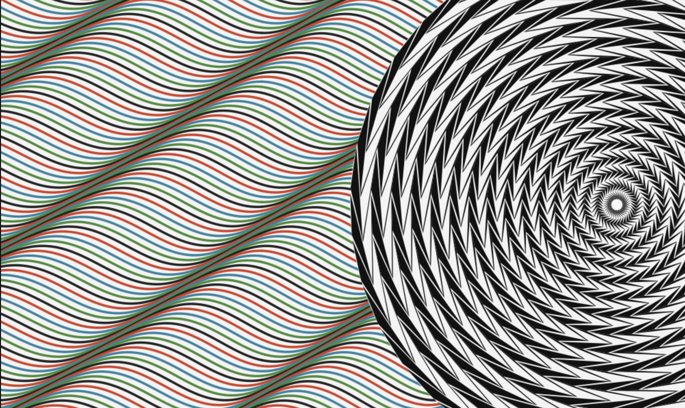

# Op Art Geometric Rendering

This project is an HTML5 Canvas implementation of a Bridget Riley-inspired optical illusion, supercharged with responsive device motion animations. It features complex, mathematically-driven geometric rendering to create mesmerizing, alternating checkerboard and wavy background patterns that physically scroll and shift as you tilt your mobile device.

## Reference Artwork
The visual implementation is closely modeled after the following iconic Op Art style:

## Canvas Result
Below is the output generated by the mathematical logic in the Canvas API:

## Features
- **Device Motion Parallax:** The canvas reads your smartphone's accelerometer data (`devicemotion`) to continuously scroll and shift the artwork based on the physical tilt of your device, complete with mathematical smoothing/dampening.
- **Phase-Shifted Waves:** A highly accurate sine-wave background utilizing linear phase-shifting to generate sweeping diagonal column alignments.
- **Concentric Checkerboard Vortex:** A 32-layer concentric ring structure that mathematically guarantees sharp, razor-edge alternating chevrons, dynamically resizing to fit any screen aspect ratio perfectly.
- **Bonus Animation:** Includes a standalone infinite `requestAnimationFrame` solar system simulation in the `solar-system/` directory.
- **Zero Dependencies:** Written entirely in Vanilla HTML5, CSS3, and JavaScript Canvas API.

## File Structure
- `index.html`: The structural entry point.
- `css/style.css`: Layout and presentation logic ensuring fluid full-screen rendering.
- `js/script.js`: The mathematical algorithms mapping out the Canvas API drawings and device motion listeners.
- `solar-system/`: A standalone infinite canvas animation loop of orbiting planets.
- `assets/`: Contains reference material and static files.

## How to Run & Test
To view the static visual rendering on a desktop, you can simply open `index.html` in any web browser.

**Testing Mobile Device Motion:** 
To test the interactive tilting features on a smartphone, modern mobile browsers **strictly require a secure HTTPS connection** to access motion sensors. 
1. **Production (Recommended):** Host the project on GitHub Pages, which automatically provides an `https://` secure context. 
2. **Local Development:** Serve the directory using a secure tunnel (e.g., running `http-server` combined with `ngrok http 8080`) to access it securely on your phone. 

*Note: Due to iOS 13+ privacy restrictions, iPhone users must tap the "Start Animation" overlay button to grant the browser explicit permission to read the gyroscope/accelerometer data.*
